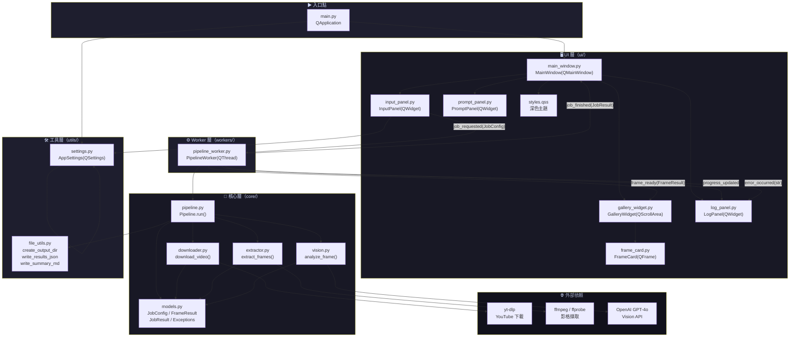
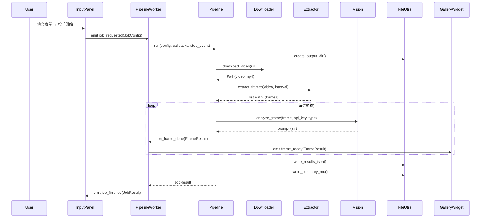
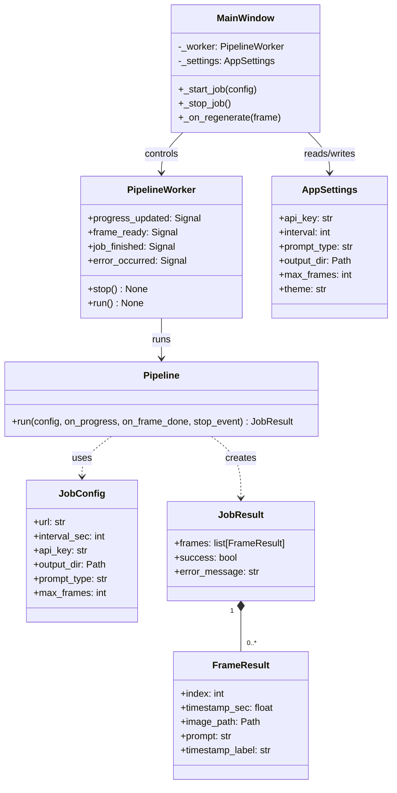

# 系統架構知識圖譜

## 模組依賴圖



---

## 資料流程圖



---

## 類別關係圖



---

## 目錄結構

```
ai-shot-cutter/
├── main.py                  ← 應用程式入口點
├── requirements.txt
├── pyproject.toml
├── .gitignore
├── README.md
├── KNOWLEDGE_GRAPH.md       ← 本文件
│
├── core/                    ← 核心業務邏輯（無 Qt 依賴）
│   ├── __init__.py
│   ├── models.py            ← 資料模型與例外
│   ├── downloader.py        ← yt-dlp 包裝
│   ├── extractor.py         ← ffmpeg 包裝
│   ├── vision.py            ← GPT-4o Vision API
│   └── pipeline.py          ← 任務協調
│
├── workers/                 ← Qt 執行緒橋接
│   ├── __init__.py
│   └── pipeline_worker.py   ← QThread 包裝
│
├── ui/                      ← 介面元件
│   ├── __init__.py
│   ├── styles.qss           ← 深色主題樣式表
│   ├── input_panel.py       ← 表單輸入面板
│   ├── frame_card.py        ← 縮圖卡片
│   ├── gallery_widget.py    ← 3欄縮圖畫廊
│   ├── prompt_panel.py      ← Prompt 預覽面板
│   ├── log_panel.py         ← 進度列 + 日誌
│   └── main_window.py       ← 主視窗（3面板佈局）
│
├── utils/                   ← 無狀態工具函式
│   ├── __init__.py
│   ├── file_utils.py        ← 輸出目錄 / JSON / MD
│   └── settings.py          ← QSettings 包裝
│
├── tests/                   ← pytest 測試套件
│   ├── __init__.py
│   ├── test_downloader.py
│   ├── test_extractor.py
│   ├── test_vision.py
│   ├── test_pipeline.py
│   └── test_gui_smoke.py
│
├── assets/                  ← 靜態資源（圖示等）
└── output/                  ← 預設輸出根目錄（.gitignore）
```
